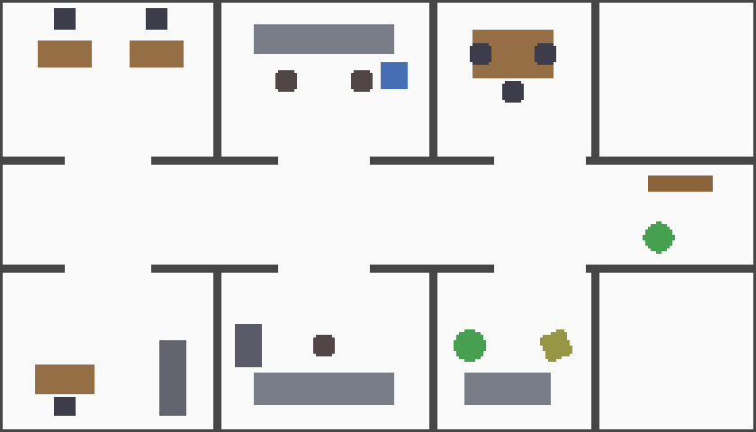
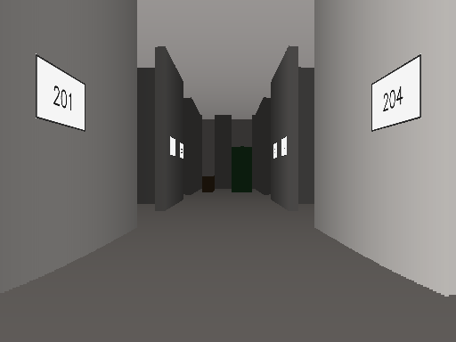
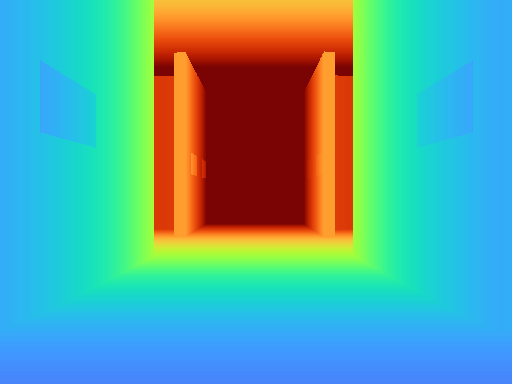
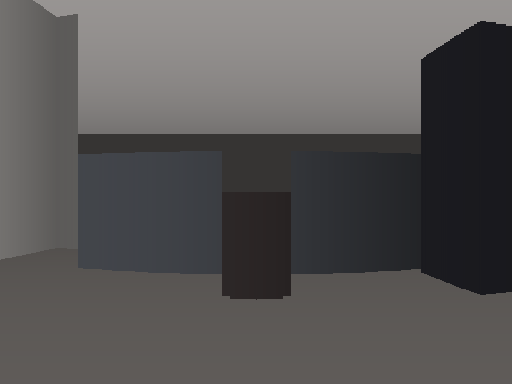
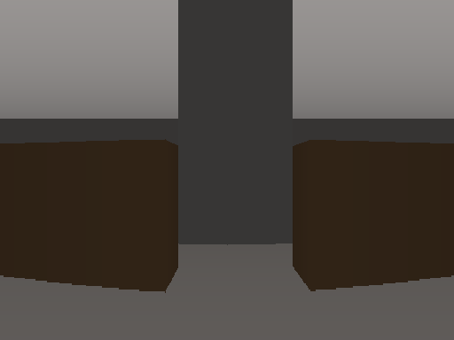

# Ridgeback AutoNav

Ridgeback AutoNav is a small ROS 2 Humble workspace for studying autonomous indoor navigation on a Clearpath Ridgeback. It ships a self contained two dimensional simulator, a browser viewer, and a reinforcement learning environment, so the loop from perception to control can be developed and tested without Gazebo, without Nav2, and without hardware. Everything runs in Docker, which makes it usable on machines that cannot run ROS 2 natively, including Apple Silicon.

This simulator is built for research and for teaching. It is meant for undergraduate and graduate students who are learning artificial intelligence and robotics, and it was prepared for the Artificial Intelligence Graduate Program at the University of the Philippines, Diliman, Quezon City, Philippines. The aim is a small, readable, and fast platform where a student can go from an idea to a trained agent in one sitting.

The simulator models a holonomic Ridgeback in a corridor with numbered rooms that are furnished as classrooms, research labs, an office, and a meeting room. It produces a LIDAR scan, wheel odometry, and a synthetic onboard RGB-D camera that renders the walls, the floor, the ceiling, the furniture, and the room number signs with correct perspective. The signs are mounted on the walls, so a sign only looks straightened when the robot turns to face it.

<p align="center"></p>

The figure above is a top down plan of the world. Light grey is wall, white is free space, and the coloured blocks are furniture. Brown blocks are desks and tables, dark blocks are chairs and stools, grey blocks are lab benches and cabinets, the blue block is laboratory equipment, and the green discs are plants.

## Contents

- [What the robot sees](#what-the-robot-sees)
- [Packages](#packages)
- [Quick start](#quick-start)
- [The task and the simulator](#the-task-and-the-simulator)
- [Observation, action, and reward](#observation-action-and-reward)
- [Configuration](#configuration)
- [Realism presets](#realism-presets)
- [Running the simulator](#running-the-simulator)
- [Using the Gymnasium environment](#using-the-gymnasium-environment)
- [Collecting data for training](#collecting-data-for-training)
- [Frequently asked questions](#frequently-asked-questions)
- [Constraints and assumptions](#constraints-and-assumptions)
- [Citation](#citation)
- [License](#license)
- [Acknowledgement](#acknowledgement)

## What the robot sees

The onboard camera is an RGB-D sensor. The colour image carries appearance and the depth image carries geometry. The pair below is a view down the corridor, with two room signs on the walls and open doorways into the rooms. The depth image uses a turbo colour map where near is blue and far is red.

<p align="center">
  
  
</p>

When the robot turns toward a doorway it looks into a furnished room. On the left is a research lab with a bench, a stool, and a tall cabinet. On the right is a classroom with two desks.

<p align="center">
  
  
</p>

## Packages

The workspace is organised into six ROS 2 packages. `ridgeback_autonav_msgs` holds the action and message definitions. `ridgeback_autonav_sim` holds the simulator and the reinforcement learning environment. `ridgeback_autonav_nav` holds the mapping, the planner, and the local controller. `ridgeback_autonav_perception` reads the room signs. `ridgeback_autonav_mission` runs the high level task. `ridgeback_autonav_bringup` holds the launch files and the shared parameters.

## Quick start

The first build pulls the ROS 2 base image, so allow a few minutes. After that the image is cached and the commands start quickly.

```
docker compose up --build view     # browser viewer, then open http://localhost:8088
docker compose up --build sim      # headless full mission in the terminal
docker compose run --rm rl         # reinforcement learning environment smoke test
```

## The task and the simulator

The reinforcement learning environment lives in `ridgeback_autonav_sim/rl_env.py` and is registered as `RidgebackAutoNav-v1`. It follows the Gymnasium interface, the maintained successor of OpenAI Gym, so it works with standard libraries such as Stable Baselines3. It is deliberately a small toy experiment rather than a benchmark.

The task is to read a room sign. At the start of an episode the robot is placed inside one of the rooms, and one room number is chosen as the target. The robot has to drive out of the room and along the corridor to that sign, then turn so that the onboard camera looks at it close to head on. By default success is declared when the robot is inside a fixed radius of the sign, and a stricter mode also requires the robot to be in front of the sign and facing it. This goal is compact and well defined, yet it still requires the agent to leave the room and to combine geometry from the LIDAR with appearance and depth from the camera, which is why it is useful both for control policies and for learned world models.

The environment does not run ROS while it steps. It reuses the simulator core, that is the occupancy world, the LIDAR raycaster, and the perspective camera renderer, as plain Python. Because there is no message passing, it steps at roughly one thousand steps per second, and that is what makes training practical. The robot carries a velocity that changes under an acceleration limit rather than instantly, so the motion has inertia and the transitions are non trivial. The rooms hold free standing furniture, and a flag scatters random objects each episode for domain randomization. Every random layout is checked with a flood fill so that the goal stays reachable from the start.

## Observation, action, and reward

The observation is a dictionary. The first part is a LIDAR scan reduced to thirty two beams and scaled to the unit interval. The second part is a small goal vector that holds the distance to the target sign together with the sine and the cosine of the bearing to it. The third part is the onboard camera frame at eighty four by eighty four pixels with four channels, namely red, green, blue, and depth. The fourth part is the body velocity, which is included so that the problem stays Markov once the robot has inertia, and which can be turned off for partially observed studies. The depth channel is included on purpose, so that a policy or a world model can use scene geometry and not only colour.

```
observation = {
    "scan":    Box(32,)        float32   normalised LIDAR
    "goal":    Box(3,)         float32   [distance, sin(bearing), cos(bearing)]
    "image":   Box(84, 84, 4)  uint8     onboard RGB-D, channels [R, G, B, depth]
    "proprio": Box(3,)         float32   body velocity [vx, vy, yaw_rate] / limit
}
action = Box(3,) float32                 [vx, vy, yaw_rate] command, holonomic, robot limits
```

The action is a body velocity command with three numbers, the forward velocity, the lateral velocity, and the yaw rate. The robot limits are 0.5 metres per second forward, 0.3 metres per second sideways, and 0.6 radians per second in yaw. A command outside the limits is clipped.

The reward keeps the radius as the definition of success and adds dense shaping so that the agent can learn from scratch. A pure radius reward is too sparse, because a random policy almost never enters the radius and so receives no signal. The shaped reward rewards progress on a potential, adds a facing bonus that ramps in as the robot nears the sign, charges a small cost per step, penalises collisions, and gives a larger bonus when the robot reaches the radius while facing the sign from the front. The potential is the straight line distance by default, and an option replaces it with the geodesic distance over free space so that progress respects walls and furniture. Because the progress term has this potential form, it does not change the optimal policy.

```
r = k_prog * (phi_prev - phi)          # progress on the potential (euclidean or geodesic)
  + k_face * max(0, cos(bearing)) * g  # facing bonus, ramped in near the goal
  - k_step                             # small time cost
  - k_coll        on collision         (ends, or a smaller per step cost if it continues)
  + k_goal + k_goal_face * quality     on success
```

The weights live in a dictionary on the environment, so the shaping can be tuned or reduced to the sparse case for an ablation.

## Configuration

The environment is one configurable env rather than a family of variants. The defaults give the realistic setting, that is acceleration limited motion that slides along walls, the velocity in the observation, a collision penalty, and a spawn that is kept away from the goal and is checked to be reachable. The table lists the main constructor arguments and what they do.

| Argument | Effect |
| --- | --- |
| `accel_max`, `slide`, `expose_velocity`, `vmax`, `action_delay` | physics and the action interface, that is the acceleration limit, wall sliding, whether the velocity is observed, the per axis velocity limits, and the control latency in steps. Setting `accel_max=None`, `slide=False`, `expose_velocity=False` recovers the simpler kinematic setting |
| `randomize_obstacles`, `n_obstacles`, `obs_size` | scatter random objects each episode for domain randomization |
| `geodesic_reward` | shape progress with the geodesic distance over free space instead of the straight line |
| `require_facing_success` | require the robot to be in front of the sign and facing it for success, not only inside the radius |
| `collision_terminate` | end the episode on contact, or keep going with a smaller per step penalty |
| `min_start_goal_dist`, `spawn_region`, `start_dist_curriculum` | control where the robot spawns |
| `actuation_noise`, `range_noise`, `depth_noise`, `pose_noise` | optional Gaussian noise on the command and the sensors |

## Realism presets

Three presets bundle the arguments above into named realism levels, from the easiest to learn to the one aimed at transfer to the real robot. They live in `ridgeback_autonav_sim/rl_env.py` as `PRESETS`, and you select one by unpacking it into the constructor.

```python
import ridgeback_autonav_sim.rl_env as M
M.register()
import gymnasium as gym
env = gym.make("RidgebackAutoNav-v1", **M.PRESETS["sim2real"])
```

| Preset | Physics | Noise and latency | Obstacles | Reward and success |
| --- | --- | --- | --- | --- |
| `kinematic` | instant velocity, no slide, no velocity in the observation | none | static only | euclidean progress, radius success |
| `realistic` (the v1 default) | acceleration limited, slides on walls, velocity in the observation | none | static only | euclidean progress, radius success |
| `sim2real` | acceleration limited, slides on walls, velocity in the observation | actuation and sensor noise on, one step of control latency | random each episode | geodesic progress, collision does not end the episode |

The presets are a starting point, not a fixed contract. For transfer in particular, begin from `sim2real` and then set `vmax` and `accel_max` to your Ridgeback's configured velocity and acceleration limits, set `dt` to your real control rate, and tune the noise and `action_delay` to the measured response of the platform. The action is already the robot interface, that is a body velocity Twist on `cmd_vel`, so a trained policy publishes straight to the robot with no reparameterisation.

## Running the simulator

The simulator runs as Docker Compose services. The viewer is the easiest way to see and drive the robot.

```
docker compose up view
# then open http://localhost:8088
```

It serves one browser page. The left side shows the onboard camera, the colour image on top and a turbo coloured depth image below. The right side shows the occupancy map that the mapping node builds as the robot moves. Drive with `W/A/S/D` for translation and `Q/E` for turning, and click a point on the map to send the robot there through the planner. Turn the robot toward a doorway or a room sign to look into the furnished rooms, since the rooms open off the side of the corridor.

To run the full autonomy without a window, use the headless service. Pick the target room with the task variable.

```
docker compose up sim
TASK="Go to Room 101" docker compose up sim
```

## Using the Gymnasium environment

The environment follows the Gymnasium interface. Register it once and construct it through `gymnasium.make`.

```python
import ridgeback_autonav_sim.rl_env as M
M.register()
import gymnasium as gym

env = gym.make("RidgebackAutoNav-v1", target_text="206")   # None picks a random room
obs, info = env.reset(seed=0)
done = False
while not done:
    action = env.action_space.sample()      # replace with your policy
    obs, reward, terminated, truncated, info = env.step(action)
    done = terminated or truncated
```

The input to `step` is an action, a length three float32 vector within the robot limits. The output of `step` is the tuple `(observation, reward, terminated, truncated, info)`. The observation is the dictionary described above. `terminated` is true on success or collision, `truncated` is true at the step limit, and `info` carries the target, the distance, whether the robot is in front of the sign, the read quality, the velocity, the obstacle count, and `is_success` for logging.

You can also construct the class directly when you want the full set of arguments from the configuration table.

```python
from ridgeback_autonav_sim.rl_env import RidgebackAutoNavEnv
env = RidgebackAutoNavEnv(randomize_obstacles=True, geodesic_reward=True,
                          require_facing_success=True)
```

To run the environment locally outside Docker, install Gymnasium into your Python environment and run the built in smoke test, which exercises a random agent, a scripted controller, and a deterministic success rollout.

```
pip install "gymnasium>=0.29"
python3 -m ridgeback_autonav_sim.rl_env
```

## Collecting data for training

The environment is fast and ROS free, so it suits on-policy learning, off-policy learning, and world model data collection.

The recipe is the same for all three. First install Gymnasium into your Python environment, since no Docker is needed for data collection. Second pick a realism preset or set the arguments yourself. Third loop over reset and step and keep what you need from each transition. Fourth save to disk in whatever layout your trainer expects. The examples below show the loop for each mode.

on-policy learning, for example with Stable Baselines3 PPO. The provided script trains the multi-input policy, a small convolutional network over the RGB-D image together with a small network over the scan, the goal, and the velocity.

```
docker compose run --rm rl bash -lc \
  'pip3 install "stable-baselines3[extra]" && python3 /opt/rl_train.py --steps 200000'
```

off-policy learning, collect transitions into a replay buffer and learn from them later. Each transition is the standard five tuple of observation, action, reward, next observation, and the done flag.

```python
import ridgeback_autonav_sim.rl_env as M
M.register(); import gymnasium as gym
env = gym.make("RidgebackAutoNav-v1")

buffer = []
obs, _ = env.reset(seed=0)
for _ in range(100_000):
    a = env.action_space.sample()              # or an exploration-policy
    nobs, r, term, trunc, info = env.step(a)
    buffer.append((obs, a, r, nobs, term))     # store transition
    obs = env.reset()[0] if (term or trunc) else nobs
```

The observation is a dictionary, so when you write to disk it is convenient to keep one array per key, plus arrays for the actions, the rewards, and the done flags.

World model data collection, record the image stream together with the actions and fit a dynamics model offline. The depth channel travels with every frame, so the model sees geometry as well as colour.

```python
obs, _ = env.reset(seed=0)
frames, actions = [], []
for _ in range(1_000):
    a = env.action_space.sample()
    frames.append(obs["image"].copy())         # 84 x 84 x 4 RGB-D
    actions.append(a)
    obs, _, term, trunc, _ = env.step(a)
    if term or trunc:
        obs, _ = env.reset()
```

For reproducible datasets, set the seed on reset and keep the noise arguments at zero. For robustness studies, turn on the obstacle randomization and the sensor noise from the configuration table.

## Frequently asked questions

**Do I need to build the Docker image to run the Gymnasium environment?**
No. The environment is pure Python and ROS free, so for training and data collection you do not need Docker at all. Install Gymnasium and import the env. Docker is only for the full ROS simulator, that is the browser viewer and the mapping and navigation stack, and for the bundled `rl` smoke service.

**How do I run it without Docker?**
Install Gymnasium, put the package on your path, and run the smoke test.

```
pip install "gymnasium>=0.29"
export PYTHONPATH=src/ridgeback_autonav_sim
python3 -m ridgeback_autonav_sim.rl_env
```

For training you also install your learning library, for example `pip install "stable-baselines3[extra]"`.

**Do I need a GPU?**
No for the simulator and the environment, which are CPU only and step at about a thousand steps per second. A GPU only helps the neural network training inside your learning library.

**Where does the world come from?**
The env loads the world from the `RIDGEBACK_AUTONAV_WORLD` path when it is set, otherwise a small built in world. To use the furnished world, point that variable at `src/ridgeback_autonav_sim/config/sim_world.yaml`, or pass `world_spec=` a path or a dict.

**How do I make a run reproducible?**
Pass a seed to `reset(seed=...)` and keep the noise arguments at zero. Every random choice, namely the spawn, the obstacles, and the sensor noise, draws from that seeded generator.

**How do I make it harder or more transferable?**
Use a realism preset, or set the individual arguments. The `sim2real` preset turns on sensor and actuation noise, control latency, and random obstacles.

**Can I train in simulation and run on the real Ridgeback?**
That is the intent. The action is a `cmd_vel` body velocity on a holonomic base, so a trained policy publishes straight to the robot. Train with the `sim2real` preset, match `vmax`, `accel_max`, and `dt` to your platform, and randomize the dynamics and the sensors.

**How do I run many environments in parallel?**
Use the vector helpers of your learning library, for example `make_vec_env` in Stable Baselines3 or `gymnasium.vector`. The env is light, so many copies fit in memory.

## Constraints and assumptions

- The robot is holonomic and velocity controlled. With the acceleration limit on, the commanded velocity is reached over a few steps rather than instantly, so the robot has inertia. The model has no full rigid body dynamics, no wheel slip, and no mass, by design, because the aim is a small toy experiment.
- The world is two dimensional. Walls, furniture, and the robot footprint live on an occupancy grid at five centimetre resolution. The camera is a 2.5D renderer, so an object is drawn at its own height as an upright block rather than as a detailed mesh.
- Collision uses an eight point footprint at the robot radius. The default response slides the robot along the wall, and a collision ends the episode unless the continue mode is selected.
- The control step is one tenth of a second with five integration substeps. All heavy work, that is the grid rebuild, the rasterisation, and the reachability search, happens only on reset, so a step stays near one millisecond even with the image observation.
- Sensor noise and actuation noise are off by default for clean learning, and are exposed as arguments for studies that need them.

## Citation

If you use this simulator in your research or your teaching, please cite it.

```bibtex
@software{ridgeback_autonav_2026,
  title       = {Ridgeback AutoNav: a 2D simulator and Gymnasium environment for indoor navigation},
  author      = {Maminta, Emmanuel G. and Dayo, Joseph Emmanuel D. and Ignacio, Michael Q.},
  year        = {2026},
  institution = {University of the Philippines},
  note        = {Artificial Intelligence Graduate Program}
}
```

Maminta, E. G., Dayo, J. E. D., and Ignacio, M. Q. (2026). Ridgeback AutoNav, a 2D simulator and Gymnasium environment for indoor navigation. University of the Philippines, Artificial Intelligence Graduate Program.

## License

This project is released under the MIT License. See [LICENSE](LICENSE) for the full text.

## Acknowledgement

Built at the University of the Philippines, Diliman, Quezon City, Philippines for the Artificial Intelligence Graduate Program.

Authors

- Emmanuel G. Maminta*
- Joseph Emmanuel D. Dayo
- Michael Q. Ignacio

\* _Correspondence to Emmanuel G. Maminta (emmanuel.maminta@eee.upd.edu.ph or egmaminta@up.edu.ph)_